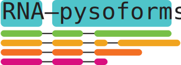

# RNApysoforms 


<!-- badges: start -->
[](https://github.com/UK-SBCoA-EbbertLab/RNApysoforms/actions/workflows/main.yml)
[](https://app.codecov.io/gh/UK-SBCoA-EbbertLab/RNApysoforms?branch=main)
[](https://lifecycle.r-lib.org/articles/stages.html#experimental)
[](https://github.com/UK-SBCoA-EbbertLab/RNApysoforms/issues)
[](https://github.com/UK-SBCoA-EbbertLab/RNApysoforms/pulls)
[](https://rna-pysoforms.readthedocs.io/en/latest/?badge=latest)

<!-- badges: end -->


`RNApysoforms` is a Python package that provides Plotly-based implementations of functionality similar to the R package `ggtranscript`. It's designed to help visualize genomic transcript structures using Plotly.

## Features

- `calculate_exon_number()`: Assigns exon numbers to exons, CDS, and introns within a genomic annotation dataset based on transcript structure and strand direction.

- `gene_filtering()`: Filters genomic annotations and optionally an expression matrix for a specific gene, with options to order and select top expressed transcripts.

- `make_plot()`: Creates a multi-panel Plotly figure combining transcript structure plots and expression data plots.

- `make_traces()`: Generates Plotly traces for visualizing transcript structures and expression data.

- `read_expression_matrix()`: Loads and processes an expression matrix, optionally merging with metadata, performing CPM normalization, and calculating relative transcript abundance.

- `read_ensembl_gtf()`: Reads a GTF (Gene Transfer Format) file and returns the data as a Polars DataFrame.

- `shorten_gaps()`: Shortens intron and transcript start gaps between exons in genomic annotations to enhance visualization.

- `to_intron()`: Converts exon coordinates into corresponding intron coordinates within a genomic annotation dataset.

## Installation

You can install `RNApysoforms` using pip:

```bash
pip install RNApysoforms
```

## Usage

Here's a basic example of how to use `RNApysoforms`:

```python

```

## Contributing

Contributions to `RNApysoforms` are welcome! Please feel free to submit a Pull Request.

## License

This project is licensed under the MIT License.
